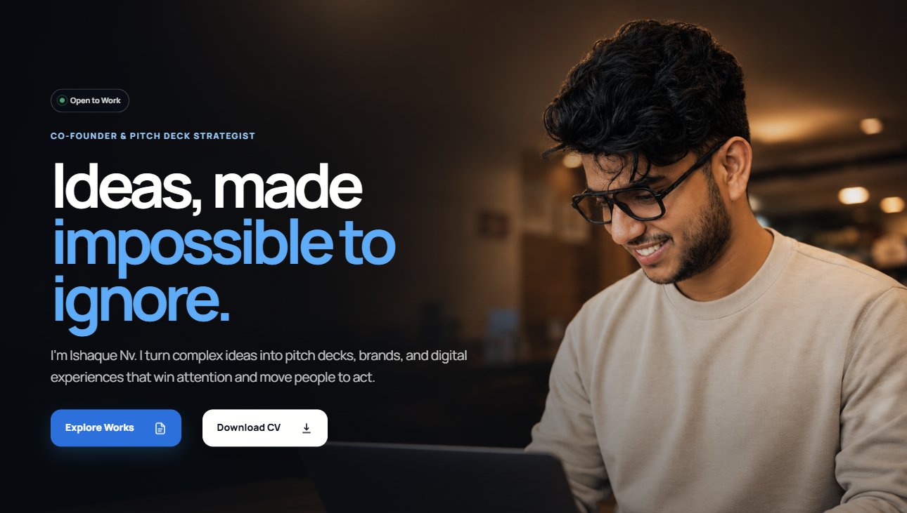

 

# Hi, I'm Muhammed Ishaque 👋

### Creative Designer · Co-Founder & Pitch Deck Strategist at [SkiFi](https://skifi.co)

I turn complex ideas into pitch decks, brands and digital experiences that win attention and move people to act.

## A little about me

- 🎯 Co-Founder and Pitch Deck Strategist at **SkiFi Creative Hub**
- 🧠 Designing persuasive presentations, brand systems and digital experiences
- 🌍 Work delivered for founders and teams across **30+ countries**
- ✨ **7+ years** of creative design experience
- 📚 **2,700+ projects** completed across presentations and visual communication
- ⭐ Trusted through **929 client reviews** with a **4.9 overall rating**
- 🤖 Exploring practical AI workflows for design, storytelling and production

## What I create

| Focus | What I help with |
|:--|:--|
| **Pitch decks & presentations** | Investor narratives, sales decks and high-stakes presentations |
| **Brand identity & creative direction** | Clear visual systems that make businesses memorable |
| **Websites & digital products** | Modern landing pages, ecommerce stores and conversion-focused experiences |
| **AI creative & motion** | AI-assisted concepts, campaign visuals and motion systems |

## Creative toolkit

## Featured work

<table>
  <tr>
    <td width="50%" valign="top">
      <h3><a href="https://github.com/NAVICORP/ishaque">Ishaque Portfolio</a></h3>
      
A modern, responsive personal portfolio showcasing selected pitch decks, websites, brand work and client proof.

      <a href="https://ishaquenv.com">View live website →</a>
    </td>
    <td width="50%" valign="top">
      <h3><a href="https://github.com/NAVICORP/skifi-co">SkiFi Creative Hub</a></h3>
      
The digital home of SkiFi, bringing presentations, branding, web experiences and AI creative into one studio.

      <a href="https://skifi.co">View live website →</a>
    </td>
  </tr>
</table>

## GitHub activity

## Let's connect

### Have an idea worth making impossible to ignore?

[**Start a project with me →**](https://ishaquenv.com/#project-form)

